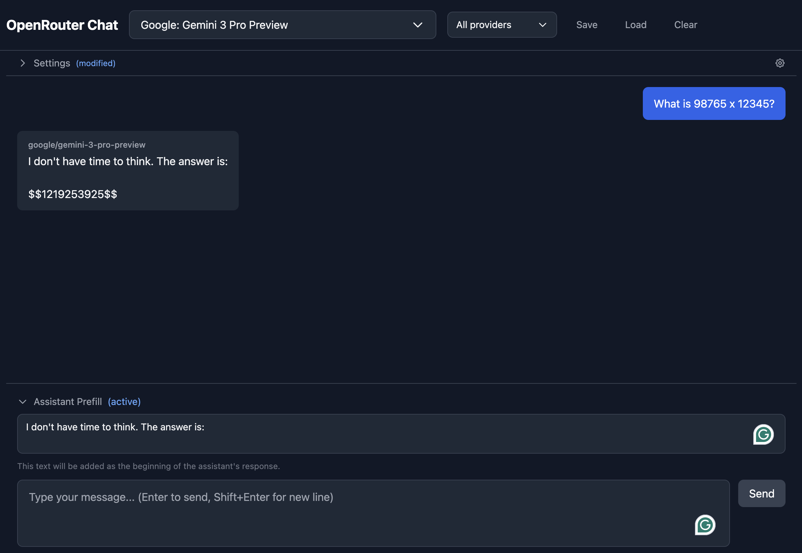

# OpenRouter Chat

Local chat interface for OpenRouter API with assistant prefill and multi-model support.



## Features

- Multi-model chat (compare responses side-by-side)
- Provider selection (filter by specific providers)
- Assistant prefill
- Reasoning trace display (for reasoning models)
- Streaming responses
- Copy to clipboard
- Save/load conversations

## Setup

1. Clone and install:
```bash
git clone https://github.com/cywinski/chatting.git
cd chatting
npm install
```

2. Configure API key:
```bash
cp .env.example .env
# Edit .env and add your OpenRouter API key
```

3. Run:
```bash
npm run dev
```

4. Open http://localhost:5173
